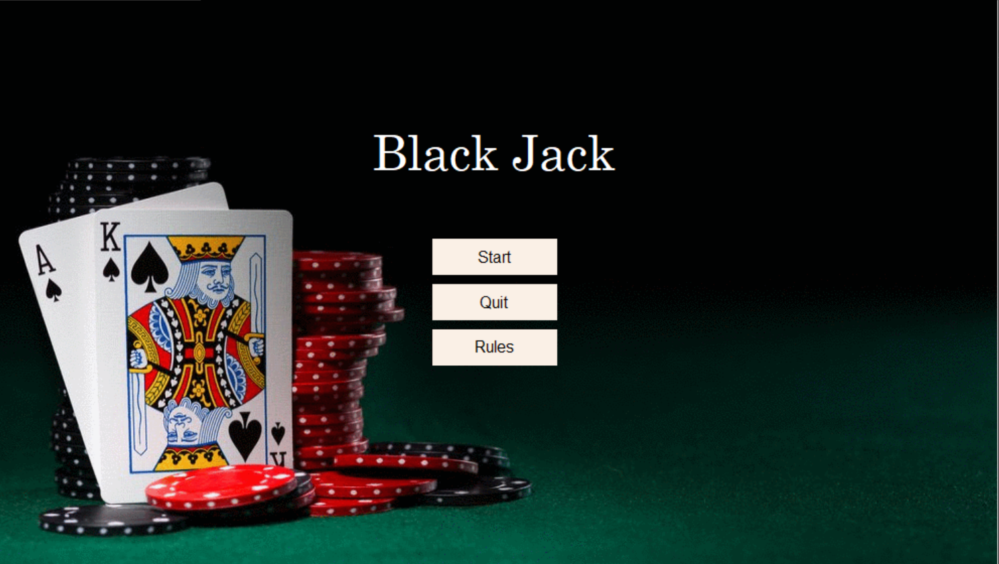
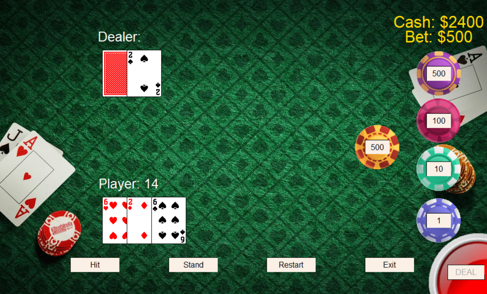

# Black Jack

A game of Black Jack coded in Python with the help of John Zelle's graphics module. This is designed in OOP style and served as a programming assignment of my CS intro course.

## Installation

Clone this repo to your local machine and run Game - origin.py or Game.py

## Contributing
Pull requests are welcome. For major changes, please open an issue first to discuss what you would like to change.

Please make sure to update tests as appropriate.

## License
[MIT](https://choosealicense.com/licenses/mit/)
